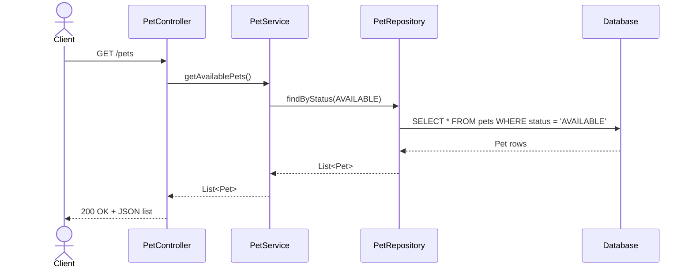
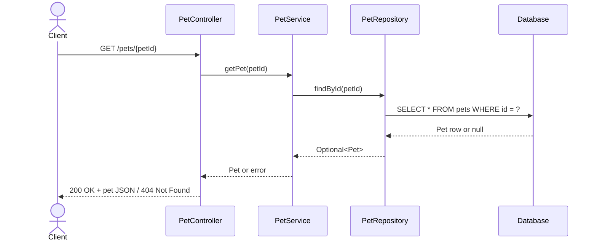
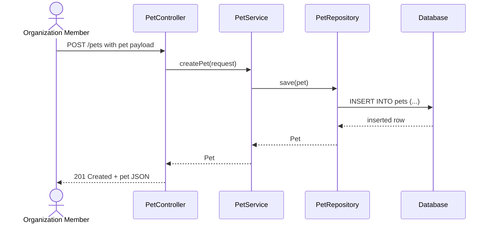
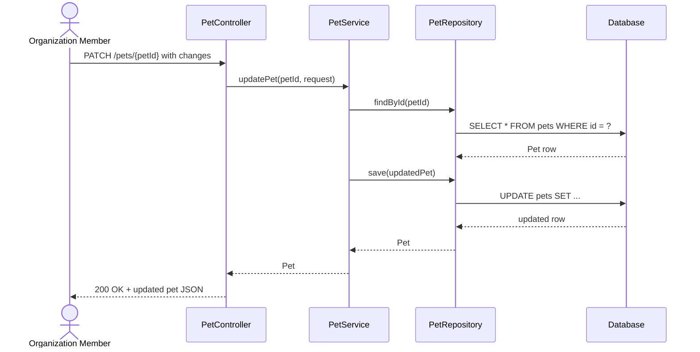
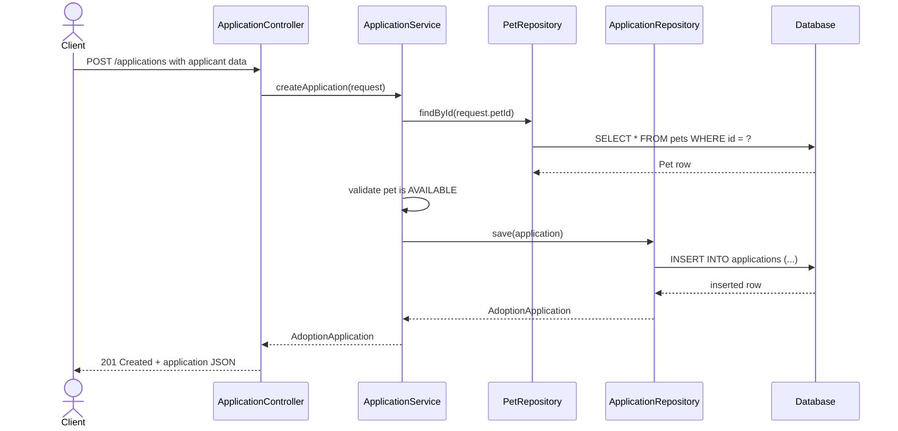
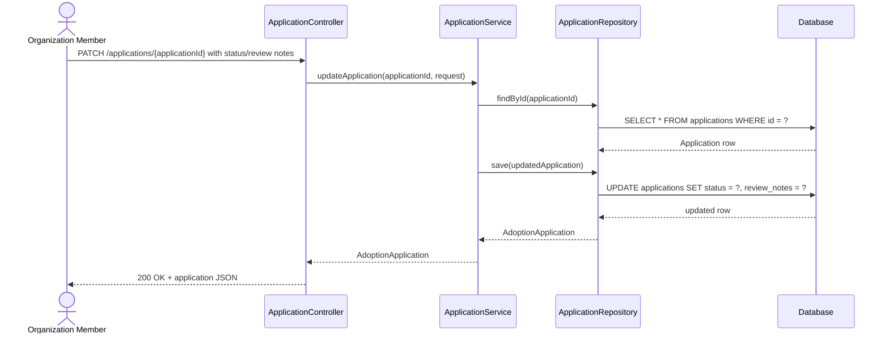

# Sequence models for the adoption service

This document describes the main request flows for the initial adoption service endpoints.

## 1. List available pets

Endpoint: GET /pets

## 2. Get pet details

Endpoint: GET /pets/{petId}

## 3. Create a new pet (organization)

Endpoint: POST /pets

## 4. Update a pet (organization)

Endpoint: PATCH /pets/{petId}

## 5. Submit an adoption application

Endpoint: POST /applications

## 6. Review or update an application (organization)

Endpoint: PATCH /applications/{applicationId}

