# Sequence models for the adoption service

This document describes the main request flows for the adoption service endpoints.
The current domain model stores pet pictures in a separate `pet_pictures` table. Each pet can have multiple pictures and the database enforces that pets have at least one picture.

## Pet / PetPicture relationship

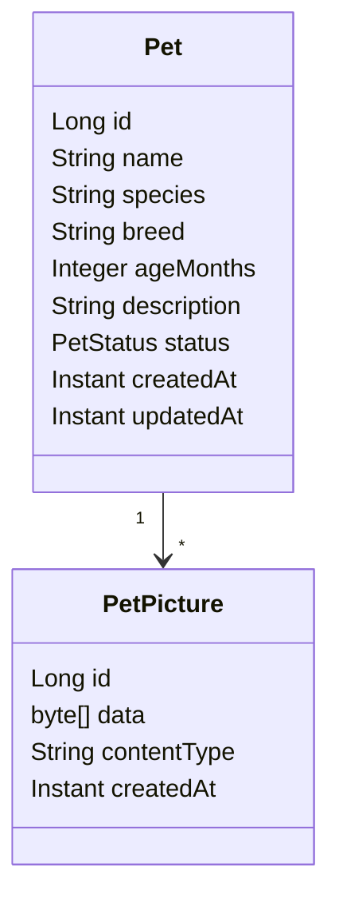
```mermaid
classDiagram
    Pet "1" --> "*" PetPicture

    class Pet {
      Long id
      String name
      String species
      String breed
      Integer ageMonths
      String description
      PetStatus status
      Instant createdAt
      Instant updatedAt
    }
    class PetPicture {
      Long id
      byte[] data
      String contentType
      Instant createdAt
    }
```

## Database schema and migration

The current implementation stores pictures in a separate `pet_pictures` table linked by `pet_id`. This supports:

- one-to-many picture storage per pet
- binary image data in `bytea`
- optional MIME content type metadata
- DB-level enforcement that every pet has at least one picture via migration-trigger logic

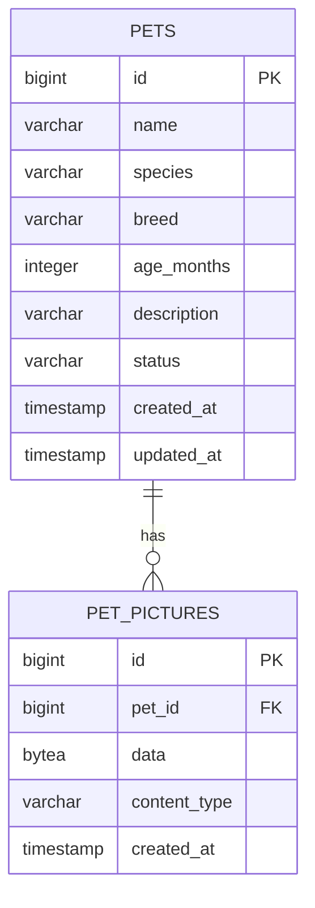
```mermaid
erDiagram
    PETS {
      bigint id PK
      varchar name
      varchar species
      varchar breed
      integer age_months
      varchar description
      varchar status
      timestamp created_at
      timestamp updated_at
    }
    PET_PICTURES {
      bigint id PK
      bigint pet_id FK
      bytea data
      varchar content_type
      timestamp created_at
    }
    PETS ||--o{ PET_PICTURES : has
```

Review notes are stored in a separate `adoption_application_review_notes` table linked to the application and to the user who wrote the note:

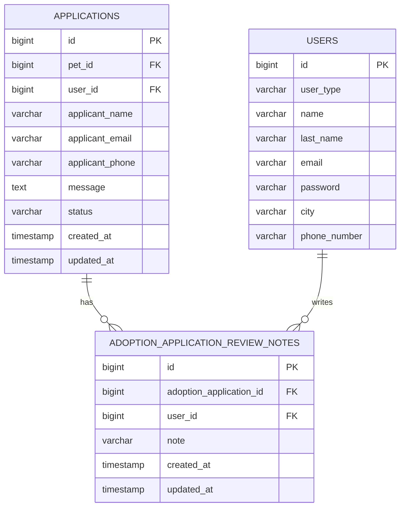
```mermaid
erDiagram
    APPLICATIONS {
      bigint id PK
      bigint pet_id FK
      bigint user_id FK
      varchar applicant_name
      varchar applicant_email
      varchar applicant_phone
      text message
      varchar status
      timestamp created_at
      timestamp updated_at
    }
    USERS {
      bigint id PK
      varchar user_type
      varchar name
      varchar last_name
      varchar email
      varchar password
      varchar city
      varchar phone_number
    }
    ADOPTION_APPLICATION_REVIEW_NOTES {
      bigint id PK
      bigint adoption_application_id FK
      bigint user_id FK
      varchar note
      timestamp created_at
      timestamp updated_at
    }
    APPLICATIONS ||--o{ ADOPTION_APPLICATION_REVIEW_NOTES : has
    USERS ||--o{ ADOPTION_APPLICATION_REVIEW_NOTES : writes
```

## 1. List available pets

Endpoint: GET /pets

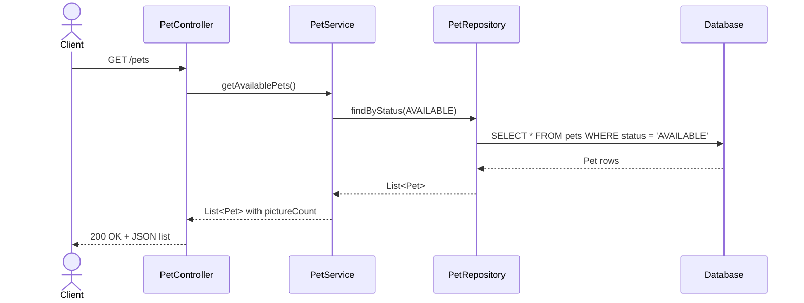
```mermaid
sequenceDiagram
    actor Client
    participant Controller as PetController
    participant Service as PetService
    participant Repo as PetRepository
    participant DB as Database

    Client->>Controller: GET /pets
    Controller->>Service: getAvailablePets()
    Service->>Repo: findByStatus(AVAILABLE)
    Repo->>DB: SELECT * FROM pets WHERE status = 'AVAILABLE'
    DB-->>Repo: Pet rows
    Repo-->>Service: List<Pet>
    Service-->>Controller: List<Pet> with pictureCount
    Controller-->>Client: 200 OK + JSON list
```

## 2. Get pet details

Endpoint: GET /pets/{petId}

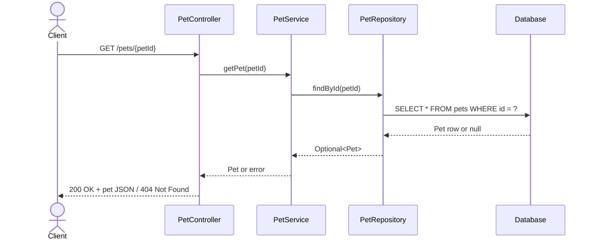
```mermaid
sequenceDiagram
    actor Client
    participant Controller as PetController
    participant Service as PetService
    participant Repo as PetRepository
    participant DB as Database

    Client->>Controller: GET /pets/{petId}
    Controller->>Service: getPet(petId)
    Service->>Repo: findById(petId)
    Repo->>DB: SELECT * FROM pets WHERE id = ?
    DB-->>Repo: Pet row or null
    Repo-->>Service: Optional<Pet>
    Service-->>Controller: Pet or error
    Controller-->>Client: 200 OK + pet JSON / 404 Not Found
```

## 3. Create a new pet (organization)

Endpoint: POST /pets

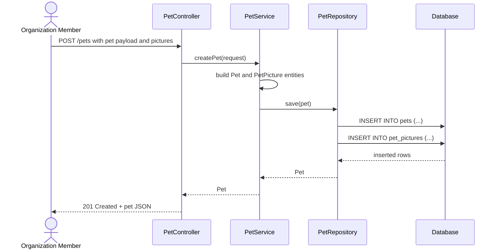
```mermaid
sequenceDiagram
    actor OrgMember as Organization Member
    participant Controller as PetController
    participant Service as PetService
    participant Repo as PetRepository
    participant DB as Database

    OrgMember->>Controller: POST /pets with pet payload and pictures
    Controller->>Service: createPet(request)
    Service->>Service: build Pet and PetPicture entities
    Service->>Repo: save(pet)
    Repo->>DB: INSERT INTO pets (...)
    Repo->>DB: INSERT INTO pet_pictures (...)
    DB-->>Repo: inserted rows
    Repo-->>Service: Pet
    Service-->>Controller: Pet
    Controller-->>OrgMember: 201 Created + pet JSON
```

## 4. Update a pet (organization)

Endpoint: PATCH /pets/{petId}

The PATCH endpoint supports partial updates. When fields are provided, only those fields are changed. If a `pictures` array is supplied, the service compares it with the current picture list and then keeps matching pictures, removes missing ones, and adds new ones.

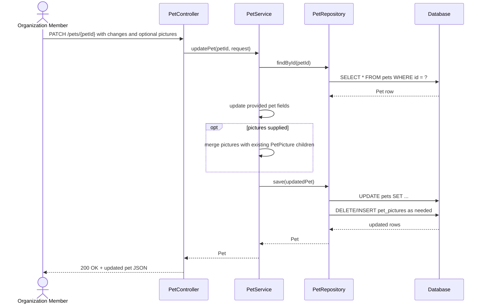
```mermaid
sequenceDiagram
    actor OrgMember as Organization Member
    participant Controller as PetController
    participant Service as PetService
    participant Repo as PetRepository
    participant DB as Database

    OrgMember->>Controller: PATCH /pets/{petId} with changes and optional pictures
    Controller->>Service: updatePet(petId, request)
    Service->>Repo: findById(petId)
    Repo->>DB: SELECT * FROM pets WHERE id = ?
    DB-->>Repo: Pet row
    Service->>Service: update provided pet fields
    opt pictures supplied
        Service->>Service: merge pictures with existing PetPicture children
    end
    Service->>Repo: save(updatedPet)
    Repo->>DB: UPDATE pets SET ...
    Repo->>DB: DELETE/INSERT pet_pictures as needed
    DB-->>Repo: updated rows
    Repo-->>Service: Pet
    Service-->>Controller: Pet
    Controller-->>OrgMember: 200 OK + updated pet JSON
```

## 5. List pictures for a pet

Endpoint: GET /pets/{petId}/pictures

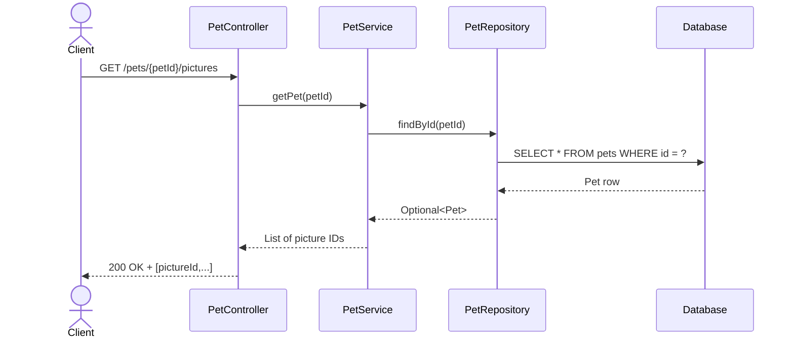
```mermaid
sequenceDiagram
    actor Client
    participant Controller as PetController
    participant Service as PetService
    participant Repo as PetRepository
    participant DB as Database

    Client->>Controller: GET /pets/{petId}/pictures
    Controller->>Service: getPet(petId)
    Service->>Repo: findById(petId)
    Repo->>DB: SELECT * FROM pets WHERE id = ?
    DB-->>Repo: Pet row
    Repo-->>Service: Optional<Pet>
    Service-->>Controller: List of picture IDs
    Controller-->>Client: 200 OK + [pictureId,...]
```

## 6. Get a pet picture by ID

Endpoint: GET /pets/{petId}/pictures/{pictureId}

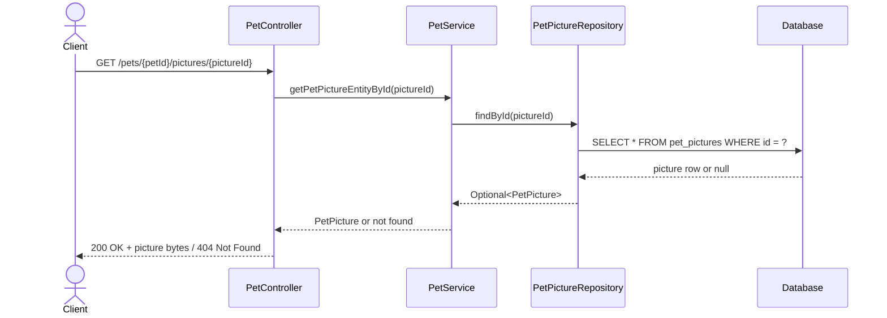
```mermaid
sequenceDiagram
    actor Client
    participant Controller as PetController
    participant Service as PetService
    participant PicRepo as PetPictureRepository
    participant DB as Database

    Client->>Controller: GET /pets/{petId}/pictures/{pictureId}
    Controller->>Service: getPetPictureEntityById(pictureId)
    Service->>PicRepo: findById(pictureId)
    PicRepo->>DB: SELECT * FROM pet_pictures WHERE id = ?
    DB-->>PicRepo: picture row or null
    PicRepo-->>Service: Optional<PetPicture>
    Service-->>Controller: PetPicture or not found
    Controller-->>Client: 200 OK + picture bytes / 404 Not Found
```

## 7. Submit an adoption application

Endpoint: POST /applications

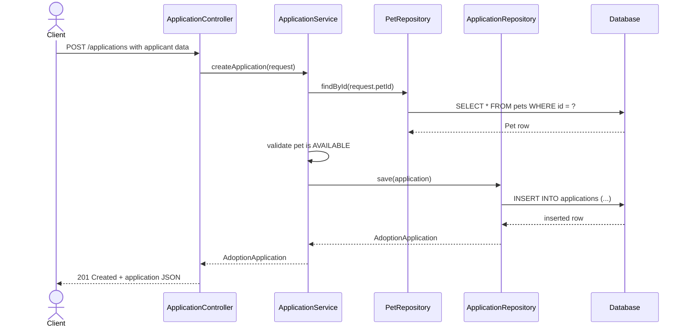
```mermaid
sequenceDiagram
    actor Client as Client
    participant Controller as ApplicationController
    participant Service as ApplicationService
    participant PetRepo as PetRepository
    participant AppRepo as ApplicationRepository
    participant DB as Database

    Client->>Controller: POST /applications with applicant data
    Controller->>Service: createApplication(request)
    Service->>PetRepo: findById(request.petId)
    PetRepo->>DB: SELECT * FROM pets WHERE id = ?
    DB-->>PetRepo: Pet row
    Service->>Service: validate pet is AVAILABLE
    Service->>AppRepo: save(application)
    AppRepo->>DB: INSERT INTO applications (...)
    DB-->>AppRepo: inserted row
    AppRepo-->>Service: AdoptionApplication
    Service-->>Controller: AdoptionApplication
    Controller-->>Client: 201 Created + application JSON
```

## 8. Partially update an adoption application (patch)

Endpoint: PATCH /applications/{applicationId}

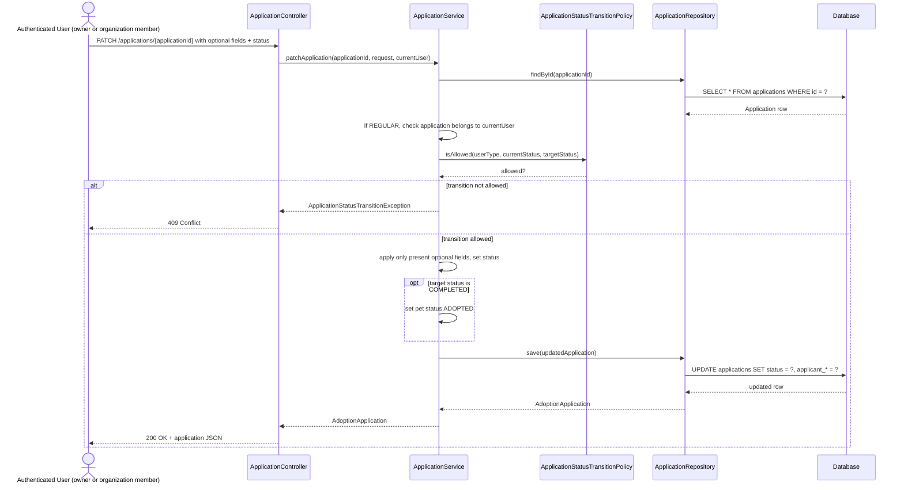
```mermaid
sequenceDiagram
    actor User as Authenticated User (owner or organization member)
    participant Controller as ApplicationController
    participant Service as ApplicationService
    participant Policy as ApplicationStatusTransitionPolicy
    participant Repo as ApplicationRepository
    participant DB as Database

    User->>Controller: PATCH /applications/{applicationId} with optional fields + status
    Controller->>Service: patchApplication(applicationId, request, currentUser)
    Service->>Repo: findById(applicationId)
    Repo->>DB: SELECT * FROM applications WHERE id = ?
    DB-->>Repo: Application row
    Service->>Service: if REGULAR, check application belongs to currentUser
    Service->>Policy: isAllowed(userType, currentStatus, targetStatus)
    Policy-->>Service: allowed?
    alt transition not allowed
        Service-->>Controller: ApplicationStatusTransitionException
        Controller-->>User: 409 Conflict
    else transition allowed
        Service->>Service: apply only present optional fields, set status
        opt target status is COMPLETED
            Service->>Service: set pet status ADOPTED
        end
        Service->>Repo: save(updatedApplication)
        Repo->>DB: UPDATE applications SET status = ?, applicant_* = ?
        DB-->>Repo: updated row
        Repo-->>Service: AdoptionApplication
        Service-->>Controller: AdoptionApplication
        Controller-->>User: 200 OK + application JSON
    end
```

## 9. Add a review note to an application

Endpoint: POST /applications/{applicationId}/review-notes

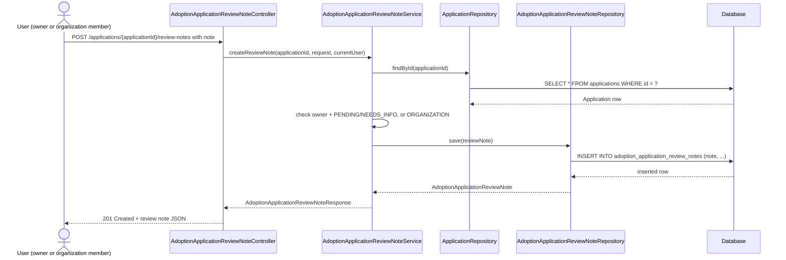
```mermaid
sequenceDiagram
    actor User as User (owner or organization member)
    participant Controller as AdoptionApplicationReviewNoteController
    participant Service as AdoptionApplicationReviewNoteService
    participant AppRepo as ApplicationRepository
    participant NoteRepo as AdoptionApplicationReviewNoteRepository
    participant DB as Database

    User->>Controller: POST /applications/{applicationId}/review-notes with note
    Controller->>Service: createReviewNote(applicationId, request, currentUser)
    Service->>AppRepo: findById(applicationId)
    AppRepo->>DB: SELECT * FROM applications WHERE id = ?
    DB-->>AppRepo: Application row
    Service->>Service: check owner + PENDING/NEEDS_INFO, or ORGANIZATION
    Service->>NoteRepo: save(reviewNote)
    NoteRepo->>DB: INSERT INTO adoption_application_review_notes (note, ...)
    DB-->>NoteRepo: inserted row
    NoteRepo-->>Service: AdoptionApplicationReviewNote
    Service-->>Controller: AdoptionApplicationReviewNoteResponse
    Controller-->>User: 201 Created + review note JSON
```

## 10. List review notes for an application

Endpoint: GET /applications/{applicationId}/review-notes

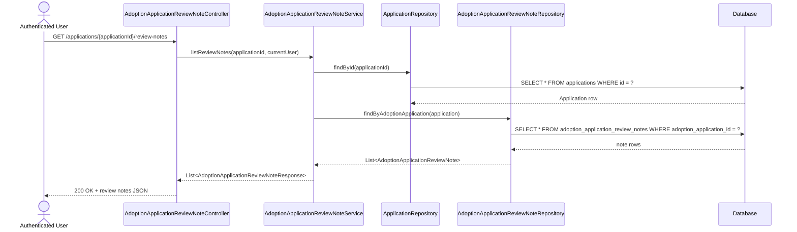
```mermaid
sequenceDiagram
    actor User as Authenticated User
    participant Controller as AdoptionApplicationReviewNoteController
    participant Service as AdoptionApplicationReviewNoteService
    participant AppRepo as ApplicationRepository
    participant NoteRepo as AdoptionApplicationReviewNoteRepository
    participant DB as Database

    User->>Controller: GET /applications/{applicationId}/review-notes
    Controller->>Service: listReviewNotes(applicationId, currentUser)
    Service->>AppRepo: findById(applicationId)
    AppRepo->>DB: SELECT * FROM applications WHERE id = ?
    DB-->>AppRepo: Application row
    Service->>NoteRepo: findByAdoptionApplication(application)
    NoteRepo->>DB: SELECT * FROM adoption_application_review_notes WHERE adoption_application_id = ?
    DB-->>NoteRepo: note rows
    NoteRepo-->>Service: List<AdoptionApplicationReviewNote>
    Service-->>Controller: List<AdoptionApplicationReviewNoteResponse>
    Controller-->>User: 200 OK + review notes JSON
```
